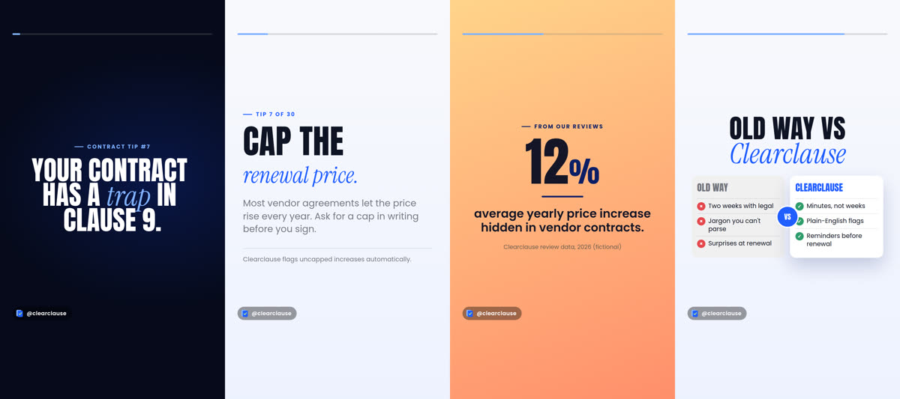

# brandreel

**Branded motion-graphics videos from a JSON script.**
Write your brand kit and a list of scenes, then render crisp MP4s in 16:9, 9:16, 1:1 or 4:5. Render one launch film, or a month of daily reels from a spreadsheet.

<p align="center"></p>

```sh
npx brandreel render video.json                       # → out/video-16x9.mp4
npx brandreel render video.json --format 9:16         # same script, Reels layout
npx brandreel batch series.json --data tips.csv       # 30 rows → 30 reels
```

- **Script, not timeline.** A video is a `video.json`: your brand (colours, fonts, logo) plus scenes like `hook`, `tip`, `stat`, `chat`, `doc-scan`, `end-card`. No editor, no keyframes.
- **16 templates, 4 style packs, custom themes.** The same script can look bold, editorial, soft or tech. Any scene can take its own colours.
- **One script, every format.** Templates reflow for landscape, portrait and square, and keep text clear of the app controls on 9:16.
- **Batch rendering.** A series is a script with `{{placeholders}}`; feed it a CSV or JSON and get a numbered set of videos.
- **Optional writer.** `brandreel write "brief" --brand brand.json` has Claude draft the script from your brand kit's voice and facts, validated like any other script. With `--custom` it may write bespoke scene code, which is linted, rendered and reviewed by the model before you see it. `brandreel look` drafts a brand's own style pack. The renderer itself never calls a model.
- **Custom scenes and music.** When no template fits, a scene is one JS module with the same helpers the built-ins use. `brandreel music` renders a licence-free background bed in three moods.
- **Frame-exact.** Scenes are HTML + [GSAP](https://gsap.com) timelines. The renderer seeks to every frame and screenshots it, so nothing is dropped or recorded in real time.
- **Fast and local.** Frames are split across parallel headless Chrome workers and joined without re-encoding: a 33-second 1080p video renders in about a minute on 4 cores. Nothing is uploaded. You need Node 20+, FFmpeg, and Chrome or Chromium.

<p align="center"></p>

## Quick start

```sh
git clone https://github.com/ajstars1/brandreel && cd brandreel
npm install
npm run example          # renders examples/clearclause/video.json (a 33 s launch film)
npm run example:reel     # renders examples/clearclause/reel.json (a 9:16 reel using the short-form templates)
```

Commands:

```sh
brandreel render   <video.json> [-o out.mp4] [--format 16:9|9:16|1:1|4:5] [--style bold|editorial|soft|tech] [--workers N]
brandreel batch    <series.json> --data rows.csv|rows.json [--format ...] [--out dir] [--only 1,4-6] [--name "{{id}}"] [--dry-run]
brandreel preview  <video.json> [--port 4400] [--guides]     # live looping preview in the browser
brandreel stills   <video.json> --at 1,4.5,9 [--guides]      # PNG frames for quick checks
brandreel validate <video.json>                              # schema check with readable errors
brandreel write    "<brief>" --brand brand.json [--kind reel|ad|explainer] [--length 15] [--stills] [--custom] [--qa 1]
brandreel look     "<description>" --brand brand.json [--stills]   # a style pack of the brand's own
brandreel music    --mood calm|upbeat|tech --seconds 15 -o bed.m4a  # licence-free background bed
brandreel templates                                          # list scene templates
brandreel styles                                             # list style packs
```

brandreel finds Chrome automatically. Set `BRANDREEL_CHROME=/path/to/chrome` to pick one, or run `npx playwright-core install chromium`.

## video.json

```jsonc
{
  "format": "9:16",            // 16:9 | 9:16 | 1:1 | 4:5
  "fps": 30,
  "style": "bold",             // bold | editorial | soft | tech, or { "extends": "soft", "css": "look.css" }
  "transition": "wipe",        // wipe | fade | cut (defaults to the style pack's choice)
  "progressBar": true,         // thin bar filling over the video, for reels
  "themes": {                  // optional custom colour sets any scene can use by name
    "sunrise": { "background": ["#ffd48a", "#ff8f6b"], "text": "#141627", "em": "#0b1f66" }
  },
  "audio": { "src": "music.mp3", "volume": 0.8, "fadeOut": 1.5 },   // optional
  "brand": {
    "name": "Clearclause",
    "handle": "@clearclause",  // shown as a small watermark on every scene
    "logo": "logo.svg",
    "logoMotion": "pop",       // pop | spin (for round or pinwheel marks)
    "colors": { "primary": "#1f5eff", "primaryDark": "#0b1f66", "accent": "#7fb2ff", "highlight": "#c6f36b" },
    "fonts": {
      "display": { "family": "Anton", "uppercase": true, "files": [{ "src": "fonts/Anton.woff2" }] },
      "body":    { "family": "Poppins", "files": [{ "src": "fonts/Poppins-Regular.woff2", "weight": 400 }] },
      "accent":  { "family": "Instrument Serif", "files": [{ "src": "fonts/InstrumentSerif-Italic.woff2", "style": "italic" }] }
    }
  },
  "scenes": [
    { "template": "hook", "duration": 3, "text": "Your contract has a *trap* in clause 9." },
    { "template": "tip", "duration": 5, "kicker": "Tip 7 of 30", "headline": ["Cap the", "*renewal price.*"],
      "body": "Most vendor agreements let the price rise every year. Ask for a cap in writing." },
    { "template": "stat", "duration": 4, "theme": "sunrise", "value": "12%", "label": "average yearly increase hidden in vendor contracts." },
    { "template": "end-card", "duration": 3.5, "tagline": "Know what you *sign.*", "cta": "Try it free" }
  ]
}
```

Paths are relative to the `video.json`. Wrap words in `*asterisks*` to set them in the accent font and colour. A headline line that is entirely accent becomes a smaller italic line. Optional colours (`ink`, `paper`, `night`, `positive`, `warning`, `negative`) have sensible defaults. Headline lines never wrap: once fonts load, the runtime measures each line and shrinks the block until the widest one fits.

Every scene takes `duration` (seconds) and an optional `theme` (`light`, `dark`, `brand`, or one of your custom themes). See [docs/templates.md](docs/templates.md) for each template's fields.

| Template | What it shows | Good for |
|---|---|---|
| `hook` | One line, word by word, as big as it fits | The first second of a reel |
| `tip` | Kicker, headline, short body, optional note | Daily tips |
| `myth-fact` | A myth is crossed out, then the fact lands | Myth busting |
| `stat` | One number counts up: `57%`, `₹3,40,000`, `3x` | Stat cards |
| `quote` | Testimonial revealed at speaking pace, with author and photo | Social proof |
| `list` | "Top 5": a title beside items that arrive one at a time | Listicles |
| `versus` | Two columns, the old way vs the better way, with a VS badge | Comparisons |
| `media` | A photo with a slow push-in and the headline over a shade | Photo posts |
| `statement` | Bold headline lines, optionally beside a card that gets stamped | Opening a story |
| `strike` | A line gets crossed out, then the real point lands | Reframing |
| `logo-reveal` | Logo pops or spins in with ripples, wordmark and tagline | The reveal |
| `chat` | A question typed to your assistant, an answer, scored results | AI products |
| `counter` | A big number counts up over a drifting wall of cards | Scale claims |
| `doc-scan` | A document is scanned and findings pop out beside it | Analysis products |
| `steps` | Headline beside a numbered path that fills in | How it works |
| `end-card` | Logo lockup, tagline, call to action, fine print | Every ending |
| `custom` | Your own scene: a JS module with the same helpers the built-ins use ([docs/custom-scenes.md](docs/custom-scenes.md)) | Hero moments |

## Custom scenes

When no template fits a moment, write the scene: one JavaScript module (plus optional CSS) that gets the same helpers the built-in templates use and returns a GSAP timeline.

```jsonc
{ "template": "custom", "duration": 5, "code": "scenes/orbit.js", "css": "scenes/orbit.css",
  "props": { "headline": ["One place for", "*every clause.*"], "labels": ["Flags", "Questions", "Renewals"] } }
```

```js
export default function orbit(root, api) {
  const { gsap, h, headline, revealLines, brand, duration, motion, props } = api;
  const tl = gsap.timeline();
  root.classList.add('orbit');                       // scope your CSS under this class
  const title = headline(props.headline);
  root.append(h('div', 'split', h('div', 'copy', title.node), h('div', 'visual', /* … */)));
  revealLines(tl, title.parts, .2);
  return tl;                                         // seeked to every frame by the renderer
}
```

`examples/clearclause/scenes/orbit.js` is a complete one (`npm run example:custom`). The contract, the helpers and the rules (deterministic, one file, scoped CSS) are in [docs/custom-scenes.md](docs/custom-scenes.md). Errors in a custom scene fail the render with the message, never a silent black frame.

## Themes and style packs

**Themes** are colours per scene. Three are built in and derived from your brand: `light`, `dark` and `brand`. Declare your own under `themes` and use them by name. A custom theme has a `background` (a colour or a two-stop gradient) and `text`, plus optional `em` (accent words), `soft` (captions), `surface` and `surfaceText` (cards). Buttons and cards pick readable colours from whether the background is light or dark.

**Style packs** are the overall look and motion: corner radii, shadows, headline sizes, textures, and how fast things enter. Set `"style"` to one of:

| Pack | Look | Motion | Default transition |
|---|---|---|---|
| `bold` | Big condensed headlines, deep shadows | Snappy | wipe |
| `editorial` | Flat backgrounds, hairlines, calmer type | Slow fades | fade |
| `soft` | Rounded, pastel tints | Bouncy | wipe |
| `tech` | Sharp corners, faint grid, glowing accents | Quick | cut |

Try one without editing the script: `brandreel stills video.json --style editorial --at 3,10`.

To make a brand's own look, extend a pack with a CSS file: `"style": { "extends": "editorial", "css": "look.css", "motion": { "enter": 0.9 } }`. Your CSS loads after the pack and can override any token in `static/styles.css` (`--radius-card`, `--shadow-card`, `--h-xl-base`, `--texture`, …) or any selector. Everything is in design pixels: the short side of the frame is always 1080.

## Reels

<p align="center"></p>

Portrait videos keep text out of the bands where Instagram, YouTube and TikTok draw their own controls (220 px top, 340 px bottom, in design pixels). Turn that off with `"safeArea": false`. Check it with `--guides`, which draws the bands on stills and previews.

- `brand.handle` adds a small watermark pill on every scene (disable with `"watermark": false`).
- `"progressBar": true` fills a thin bar over the length of the video.
- `hook` → `tip` → `end-card` at 9:16 is an 11-second reel. Add `audio` for music.

## Write the script with Claude

brandreel itself is deterministic: the same JSON always renders the same video. The one place a model fits is writing the JSON, and `write` does that:

```sh
brandreel write "3 things to check before renewing a health plan" --brand brands/policygaido/brand.json --kind reel --stills
brandreel write "30-second launch ad for the pilot programme" --brand brands/dawnwell/brand.json --kind ad --format 16:9 --via gemini
```

### Which model writes

The renderer never calls a model; `write` and `look` do, through whichever backend you have:

| Backend | Needs | Default model | Pick it with |
|---|---|---|---|
| `anthropic` | `ANTHROPIC_API_KEY` (or `ant auth login`) | `claude-opus-5` | automatic when the key is set |
| `gemini` | `GEMINI_API_KEY` or `GOOGLE_API_KEY` | `gemini-3.5-flash` | automatic when the key is set |
| `claude-code` | the `claude` CLI installed and logged in (a Claude subscription) | your session's model | automatic when no key is set |

`--via anthropic|gemini|claude-code` or `BRANDREEL_WRITER=…` forces one; `--model` picks the model inside it. The `claude-code` backend runs `claude -p` with a JSON schema, so it uses your plan's allowance rather than API billing, and it works from inside a Claude Code session too. All three go through the same validation and repair loop; review rounds send the frames as images (Gemini and the API directly, Claude Code by reading the files).

Inside Claude Code you don't even need the backend: the repo ships a `brandreel` skill, so "make a 15-second reel for PolicyGaido about room rent limits" has the session draft the JSON itself, validate it with the CLI and look at the stills.

A **brand kit** (`brand.json`) is a `video.json` without `scenes`, plus two sections the writer reads:

```jsonc
{
  "brand": { ... }, "style": "bold", "themes": { ... },      // exactly as in video.json
  "voice": {
    "audience": "Indian families buying health insurance, often for parents",
    "tone": "plain, direct, on the customer's side",
    "rules": ["Never use em dashes", "Never promise a claim will be paid"],
    "cta": "Ask GaidoAI at policygaido.com",
    "avoid": ["fear-mongering", "'guaranteed'"]
  },
  "facts": ["Compares 200+ health insurance plans", "Free advice, no spam calls"]
}
```

The model gets the template reference, the writing rules, your voice and facts, and the brief, and returns the scenes as structured output. The draft is validated exactly like a hand-written script; if it fails, the errors go back to the model for a repair round. The result lands in `<kit dir>/drafts/<slug>.json`, ready for `preview`, `stills` and `render`. `--stills` renders one frame per scene straight away so you can approve it by eye.

The prompt tells the model to use only the facts you listed, so numbers, plan names and testimonials are never invented. Check the copy anyway before you publish; it is your brand.

No model at all? `--show-prompt` prints the exact prompt and reply shape to paste anywhere, and `--from draft.json` imports the JSON you get back through the same validation.

### Letting it write scenes, and reviewing its own work

```sh
brandreel write "how a claim gets decided, with a diagram of the four gates" --brand brands/policygaido/brand.json --custom --qa 2
```

With `--custom` the model may add up to two custom scenes for moments the templates can't express (a diagram, a metaphor, a bespoke chart). Each one is checked against the custom-scene rules (no randomness, timers, network or imports), written to `drafts/<slug>/scene-N.js`, then rendered to stills at 25%, 60% and 95% of the scene. Those frames go back to the model with the code, and it returns either "ok" or complete replacements, for up to `--qa` rounds. A scene that throws at load time is reported the same way, so the model fixes its own syntax errors. You still get the last word: the stills are on disk next to the draft.

### A look of the brand's own

```sh
brandreel look "warm, editorial, generous whitespace, thin rules, dawn colours" --brand brands/dawnwell/brand.json --stills
```

`look` asks the model for a CSS file that extends one of the four packs (tokens first, theme backgrounds second, selectors last) and up to three custom themes. It writes `look.css` next to the kit, updates the kit's `style` and `themes`, and with `--stills` renders a fixed six-scene sample (hook, tip, stat, list, chat, end-card) so you can judge it before using it.

## Batch: a series from a spreadsheet

A series is a normal `video.json` with `{{placeholders}}`:

```jsonc
{ "template": "tip", "duration": 5.6,
  "kicker": "Tip {{n}} of 30",
  "headline": ["{{headline1}}", "{{headline2?}}"],
  "body": "{{body}}",
  "note": "{{note?}}" }
```

- `{{name}}` inserts the row's text, anywhere in a string.
- `{{name?}}` is optional: an empty cell removes the field (or the list entry) entirely.
- `{{name:number}}` and `{{name:json}}` must be the whole string and give a number or parsed JSON (for `counter.value`, `list.items`, scores).

Then:

```sh
brandreel batch series/tips.json --data series/tips.csv --dry-run     # validate every row
brandreel batch series/tips.json --data series/tips.csv               # → series/out/<id>-9x16.mp4 per row
brandreel batch series/tips.json --data series/tips.csv --only 3,7-9  # a few rows
```

Files are named by the row's `id`, `slug` or `name` column (or `--name "tip-{{n}}"`), else `row-01`, `row-02`, …. The CSV parser handles quotes, commas and newlines inside cells; a `.json` array of objects works too. Rows that fail validation are reported and skipped; the rest still render.

The same mechanism makes ad variants: three hooks and two calls to action in six rows render six ads to test against each other. `brands/<name>/series/ad-variants.json` with an `id,kicker,hook,cta` CSV is all it takes.

## Music

```sh
brandreel music --mood calm --seconds 12 -o music/calm-12s.m4a
```

A small deterministic synthesizer renders a background bed (chords, a soft beat, fades) in `calm`, `upbeat` or `tech`, so every video can have music with no licensing questions. Attach it with `"audio": { "src": "music/calm-12s.m4a", "volume": 0.55, "fadeIn": 0.4, "fadeOut": 1.8 }`; the same field takes any real track you own the rights to.

## How it works

1. `load.ts` validates the script with [zod](https://zod.dev) and maps local assets to URLs.
2. `server.ts` serves a page with the runtime, GSAP, the base stylesheet, the style pack and your assets on `127.0.0.1`.
3. The runtime (`src/runtime/`) builds each scene's DOM and GSAP timeline, applies the theme and motion preset, and chains everything on one paused master timeline with transitions.
4. `render.ts` opens one headless Chrome per worker. Each worker seeks the timeline to each of its frames, captures it, and pipes PNGs into its own FFmpeg segment. The segments are concatenated without re-encoding, and the audio is mixed in with a fade-out.

## Private brand kits

Put client work in `brands/<name>/`. The folder is gitignored, so commercial fonts and client logos never end up in the repo.

## Development

```sh
npm run build       # tsc for the CLI and the browser runtime
npm run typecheck
npm test            # vitest
```

See [CONTRIBUTING.md](CONTRIBUTING.md) to add a template or a style pack.

## Licence

MIT. GSAP is installed from npm under its own [standard licence](https://gsap.com/standard-license). The example fonts are under the SIL Open Font License (see `examples/clearclause/fonts/OFL.txt`). Clearclause is a fictional brand.
